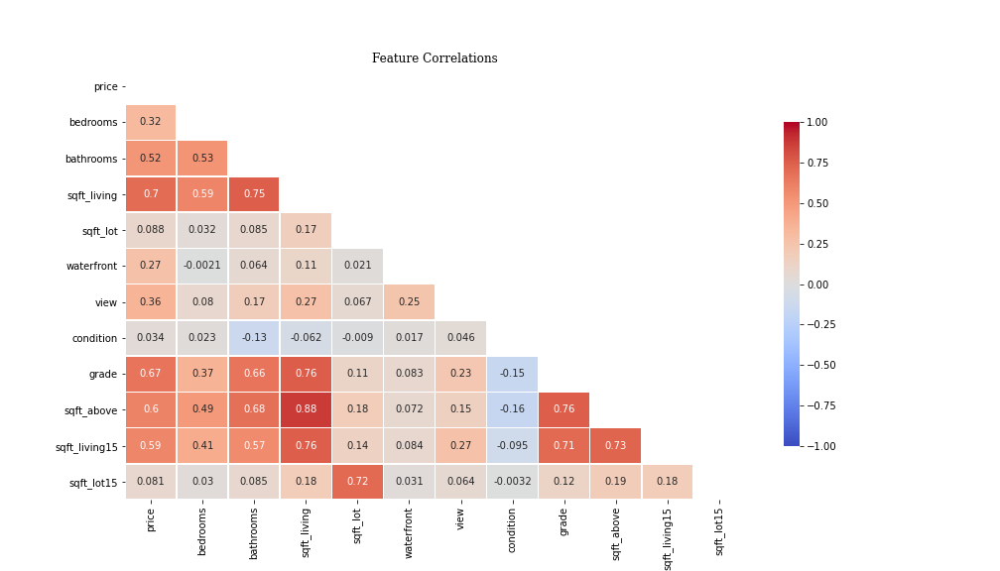

# Regression Analysis for KC House Data


**Author**: Martin Reyes

# Project Description:

Analyzing data and using linear regression models to come up with recommendations for USAA's home insurance premiums.


<hr style="border:1px solid gray"> </hr>

## Overview

This project analyzes which house features have a linear relationship with the house's price to determine whether USAA's home insurance premiums are valid. The analysis shows that USAA's premium for a house should have have a relationship with the home's square footage, King County grade, and position above or below the 47.5° N latitude line. It also shows that there should be no relationship with the square footage of the home's lot, the time the house was sold, or the condition grade given in the dataset. USAA can use the insights in this project to determine whether changes need to be made to produce valid home insurance premiums.

<hr style="border:1px solid gray"> </hr>

## Business Problem

USAA wants to determine which house features should affect their home insurance premiums. In this project, linear regression models will be used to analyze which home features (square footage, condition, etc.) best determine house prices. Recommendations will be made to determine which features should raise, lower, or not affect premiums.

<hr style="border:1px solid gray"> </hr>

## Data

This project uses the King County House Sales dataset, which can be found in  `kc_house_data.csv` in the data folder in this repo. The description of the column names can be found in `column_names.md` in the same folder. A cleaned version of this data is saved as `clean_data.csv`

<hr style="border:1px solid gray"> </hr>

## Methods

This project uses the OSEMN Process which has the following steps: Obtain the Data, Scrub the Data, Explore the Data, Model the Data, and Interpret the Data. This process allows for an organized workflow to allow anyone to easily keep track of how insights and models were made. It's important to note that this model is iterative and not a strict, step-by-step process. This allows for improvements to be made during EDA and modeling.

## Key Insights



### Features that are most correlated with price:
* **square footage, KC grade, square footage of 15 nearest neighbors, bathrooms**
   
### Features we know have no linear relationship with price:
* **condition, date/month/quarter sold, lot square footage, square footage of 15 nearest neighbors' lots**
    
### Best performing model suggests:
* **square footage, KC grade, and position above or below 47.5° N latitude all have a strong relationship with price**

### Most trusted model suggests:
* **square footage of 15 nearest neighbors and KC grade have some linear relationship with price**

<hr style="border:1px solid gray"> </hr>

### Next Steps

Further analyses can help better understand ratings, genre, and profitability:
* **Focus on smaller subsets of houses (smaller price range, age range etc.)**
* **More EDA on the features**
* **Use advanced feature selection/engineering techniques to produce a better linear regression model that both meets its assumptions and explains variation in price**
* **Develop a ML model to accurately predict house prices**

<hr style="border:1px solid gray"> </hr>

## For More Information

Please review the full EDA and modeling in [the Jupyter Notebook](./EDA_and_Modeling.ipynb) or the [presentation](./Regression_Analysis_Presentation.pdf).

For any additional questions, please contact **Martin Reyes** at **martinreyes.eng@gmail.com**

<hr style="border:1px solid gray"> </hr>

## Repository Structure

```
├── data
├── images
├── EDA_and_Modeling.ipynb
├── Obtaining_and_cleaning_data.ipynb
├── README.md
├── Regression_Analysis_Presentation.pdf
```